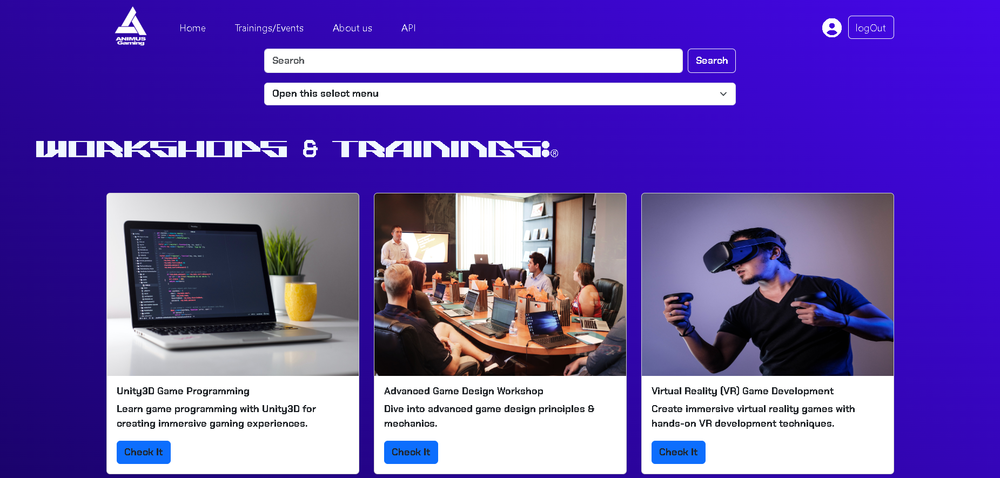
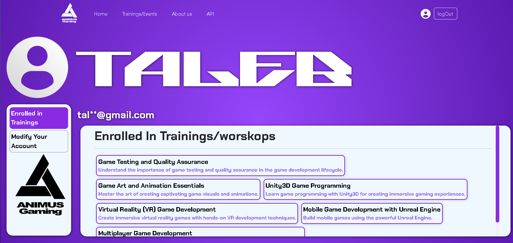
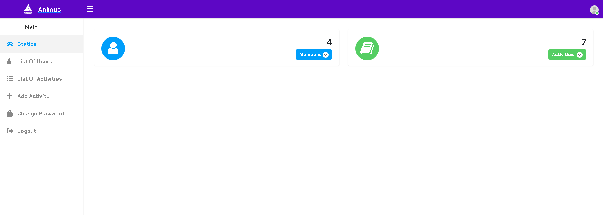

# Animus Club Project - Angular Application  

A collaborative project about the Animus Club activities at our university was created in November 2023. The project demonstrates the use of various Angular concepts and practices learned during our sessions, such as Two-way Data Binding, Event Binding, Routing, Guards, Pipes, and more.

---

## 🚀 **Getting Started**  

Follow these steps to run the project on your local machine.

### 1. **Clone the Repository**  

```bash  
git clone https://github.com/MeDjb10/AnimusClub.git
cd AnimusClub
```  

### 2. **Install Dependencies**  

Run the following command to install the necessary dependencies:  

```bash  
npm install  
```  

### 3. **Set up the JSON Server**  

The project uses a JSON file to simulate a backend. To start the JSON server:  

```bash  
cd src/app/json  
json-server --watch data.json  
```  

This will start the server at [http://localhost:3000](http://localhost:3000).  

### 4. **Start the Angular Application**  

In the main project directory, start the Angular development server:  

```bash  
ng serve  
```  

The application will run at [http://localhost:4200](http://localhost:4200).  

---

## ⚙️ **Features**  

This project incorporates various Angular features, including:  

- **Two-way Data Binding**  
- **Event Binding**  
- **Property Binding**  
- **String Interpolation**  
- **Routing**  
- **Guards** for route protection  
- **Pipes** for transforming data  
- **Reactive Forms** with validators  
- **Server HTTP** communication  

---

## 📸 **Screenshots**  

Here are some screenshots of the project:  

### Landing Page  
  

### Homepage  
  

### Trainings & Workshops 
  

### Profile 
 

### SignUp Form  
  

### Admin Dashboard  
  

---

## 🛠 **Technologies Used**  

- **Angular**: Framework for building dynamic, single-page web applications.  
- **JSON Server**: Mock server to simulate backend API.  

---

## 📜 **License**  

This project is licensed under the MIT License. For details, check the [LICENSE.md](LICENSE.md) file.  

---

## 💬 **Contributing**  

Contributions are welcome! Fork the repository, make your changes, and submit a pull request.  

---

## 🧑‍💻 **Contact**  

For any questions, feel free to reach out!  

- Email: [jabou.medamine@gmail.com](mailto:jabou.medamine@gmail.com)
- Email: [mouelhi.medtaleb@gmail.com](mailto:mouelhi.medtaleb@gmail.com)  
